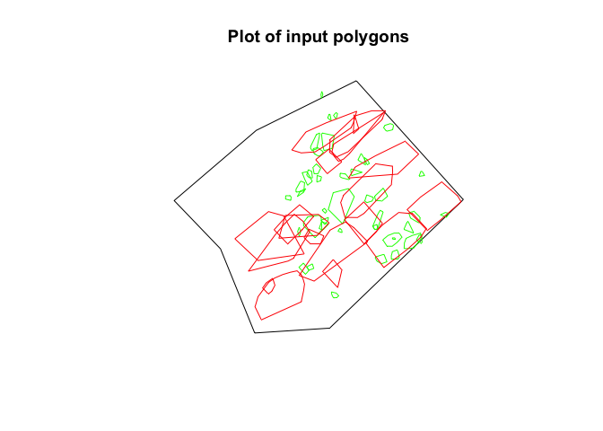
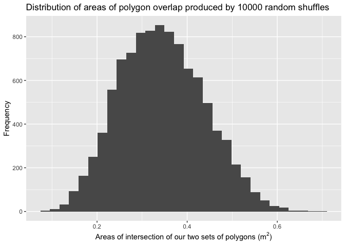
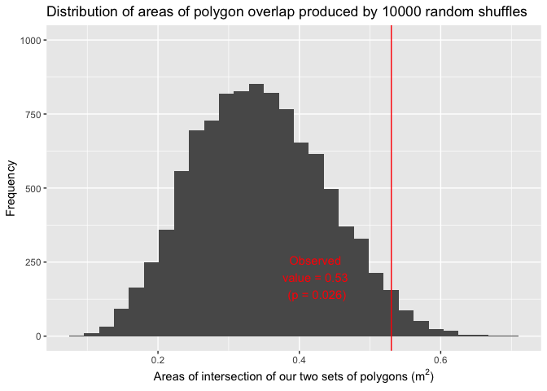

<!-- README.md is generated from README.Rmd. Please edit that file -->

# polygonoverlap

<!-- badges: start -->

<!-- badges: end -->

The goal of polygonoverlap is to compute the probability that an
observed area of overlap between two sets of polygons is due to chance.
We assume one set of polygons can freely move, and another set is fixed
in space. We randomly relocate the first set of polygons many times, and
for each relocation, we compute the area of overlap. After repeating
this random relocation many times, we generate a distribution of overlap
areas. We compare this distribution of randomly-generated overlap areas
to the observed overlap area to compute a p-value. This is useful for
answering the question “is the location of the first set of polygons
non-random with respect to overlapping the fixed set of polygons?”, or
“is the observed amount of overlap of the two sets of polygons due to
chance alone, or some other process?”

## Installation

You can install the development version of polygonoverlap from GitHub
with:

``` r
remotes::install_.packages_github("benmarwick/polygonoverlap")
```

## Example

Let’s load the library and some polygon shapefiles to work with.
Currently this works with shapefiles that are loaded into R using
`rgdal::readOGR()` to produce a `SpatialPolygonsDataFrame` object.

``` r
library(polygonoverlap)
library(here)
#> here() starts at /Users/bmarwick/Desktop/2019 Autumn 482 & 486/polygonoverlap
```

``` r
# load the data contained in the pkg so we can demonstrate
bounding_box_polygon <- rgdal::readOGR(here("data-raw/MK_II_excv_outline.shp"))
#> OGR data source with driver: ESRI Shapefile 
#> Source: "/Users/bmarwick/Desktop/2019 Autumn 482 & 486/polygonoverlap/data-raw/MK_II_excv_outline.shp", layer: "MK_II_excv_outline"
#> with 1 features
#> It has 1 fields
input_polygons <- rgdal::readOGR(here("data-raw/rock_poly.shp"))
#> OGR data source with driver: ESRI Shapefile 
#> Source: "/Users/bmarwick/Desktop/2019 Autumn 482 & 486/polygonoverlap/data-raw/rock_poly.shp", layer: "rock_poly"
#> with 42 features
#> It has 5 fields
other_polygons <- rgdal::readOGR(here("data-raw/skele_poly.shp"))
#> OGR data source with driver: ESRI Shapefile 
#> Source: "/Users/bmarwick/Desktop/2019 Autumn 482 & 486/polygonoverlap/data-raw/skele_poly.shp", layer: "skele_poly"
#> with 19 features
#> It has 4 fields
```

We can take a quick look to see these polygons, green is our
`input_polygons` which we assume can be freely moved, and red is our
`other_polygons`, which we assume are fixed:

``` r
sp::plot(bounding_box_polygon)
sp::plot(input_polygons, add = TRUE, border = "green")
sp::plot(other_polygons, add = TRUE, border = "red")
title(main = "Plot of input polygons")
```



Notice that the red polygons overlap themselves a bit. In our function
below we dissolve those overlap areas into single polygons so we don’t
measure multiple overlaps in one location.

Now we shuffle the set of `input_polygons` to random locations within
our bounding box area. We repeat this random shuffle 100 times, and save
the locations of the polygons for each random shuffle event:

``` r
# This may take a minute or two
n <- 1000
input_polygons_randomly_shuffled <- 
  shift_poly_to_random_points(bounding_box_polygon,
                              input_polygons,
                              n)
```

For each random shuffle event, we compute the size of the area of
intersection (or overlap) between our `input_polygons` and another set
of polygons (we do not shuffle this other set):

``` r
areas_of_overlap_from_random_shuffle <- 
  compute_overlap_area_of_polygons_randomly_shuffled(input_polygons_randomly_shuffled, 
                                                     other_polygons)
```

We can make a plot of this distribution:

``` r
library(ggplot2)
ggplot(areas_of_overlap_from_random_shuffle,
       aes(area)) +
  geom_histogram() + 
    labs(x = expression("Area of intersection of rocks and skeletons (m"^2*")"),
         y = "Frequency") +
  ggtitle(paste0("Distribution of areas of polygon overlap produced by ", n, " random shuffles"))
#> `stat_bin()` using `bins = 30`. Pick better value with `binwidth`.
```



Now we can compare this randomly generated distribution to the observed
overlap of our two sets of shapefiles:

``` r
observed_polygon_overlap <- 
  compute_overlap_area_of_polygons_observed(input_polygons, 
                                            other_polygons)
```

The value we get here is 0.494 square meteres. We can combine this with
our random distribution data to compute a p-value:

``` r
pval <- 1 - sum(areas_of_overlap_from_random_shuffle$area <= observed_polygon_overlap) / n
```

Using this p-vaue we can say that 7.3% of our randomly-shuffled input
shapefiles result in an overlap with the other shapefiles that is equal
to or greater than our observed overlap area. This indicates that our
observed area of overlap is probably not random but a result of
deliberate placement of the input polygons over or near the other
polygons. The answer to the question is ‘yes, the association of the two
polygon sets is non-random’.

And we can show the observed value and p-value on the histogram like
this:

``` r
ggplot(areas_of_overlap_from_random_shuffle,
       aes(area)) +
  geom_histogram() + 
    labs(x = expression("Area of intersection of rocks and skeletons (m"^2*")"),
         y = "Frequency") +
  ggtitle(paste0("Distribution of areas of polygon overlap produced by ", 
                 n, 
                 " random shuffles")) + 
  geom_vline(xintercept = observed_polygon_overlap, 
             col = "red") + 
  annotate("text", 
           x = 0.45, y = 65, 
           label = paste0("Observed \nvalue = ",
                         round(observed_polygon_overlap,2), 
                         " \n(p = ", round(pval,3), ")"), col = "red")
#> `stat_bin()` using `bins = 30`. Pick better value with `binwidth`.
```



## Background

This method was developed for this publication:

> Lowe, Kelsey M., Lynley A. Wallis, Colin Pardoe, Ben Marwick5, Chris
> Clarkson, Tiina Manne, Mike A. Smith and Richard Fullagar 2014.
> Ground-penetrating radar and burial practices in western Arnhem Land,
> Australia. *Archaeology in Oceania*
> <https://doi.org/10.1002/arco.5039>

This package is an excerpt of code and data prepared for that paper,
which was originally uploaded to
<https://github.com/benmarwick/Rocks-and-burials-at-Madjebebe> and
archived at <http://dx.doi.org/10.5281/zenodo.10616>
